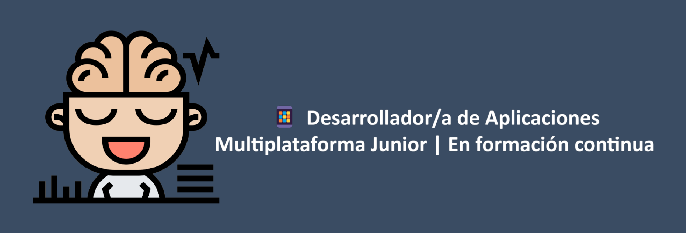

  <h1 align="center">Hi, soy Lis 👋</h1>

  
  

## 🌟Sobre mí

- 🔭 Actualmente trabajando en: mis prácticas de Desarrollo de Aplicaciones Multiplataforma (DAM).
- 🌱 Aprendiendo: Java, Kotlin, React Native, JavaScript y TypeScript. Siempre explorando nuevas tecnologías.
- 👯 Busco colaborar en: proyectos de desarrollo móvil y multiplataforma.
- 📫 Contáctame: 
 | 

Soy una persona versátil y en constante aprendizaje. Mi trayectoria me ha llevado por diferentes experiencias, desde el sector administrativo hasta el servicio al cliente, trabajando como camarera y en el Ministerio para la Transición Ecológica y el Reto Demográfico. Estas experiencias me han permitido desarrollar habilidades clave como la organización, la comunicación y la capacidad de adaptación.

Sin embargo, mi verdadera pasión es la tecnología. Por eso, decidí formarme en Desarrollo de Aplicaciones Multiplataforma (DAM), donde he adquirido conocimientos en Java, Kotlin, Python, C#,Reac, React Native, JavaScript y TypeScript. Actualmente, estoy realizando mis prácticas y buscando la oportunidad de comenzar mi carrera profesional en el mundo del desarrollo.

💡 Me motiva la resolución de problemas, el aprendizaje continuo y la posibilidad de crear soluciones digitales que hagan la diferencia. Estoy entusiasmada por seguir creciendo en este sector y aportar mis conocimientos y habilidades en un entorno profesional.
