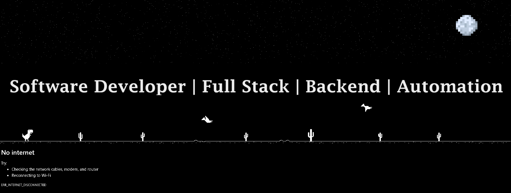
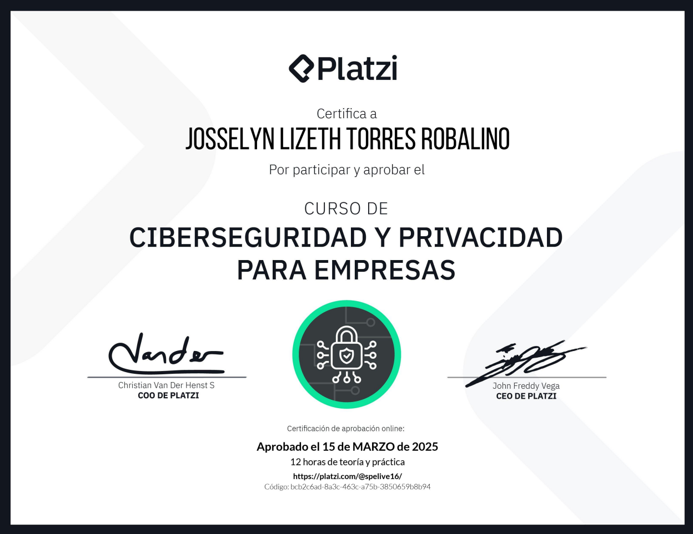

  <h1 align="center">Hi, soy Lis 👋</h1>

  
  

## 🌟Sobre mí

🎯 **Desarrolladora de software** 
experiencia práctica en desarrollo backend, frontend y automatización de procesos.

🖥️ He trabajado con tecnologías como:
- **Backend:** Java, Spring Boot, Node.js, PostgreSQL, SQL, NoSQL
- **Frontend:** Kotlin, Jetpack Compose, React Native, React, TypeScript, JavaScript, HTML, CSS
- **Automatización:** n8n (no-code / low-code)
- **Otros:** Git, GitHub, Clean Architecture, APIs REST, Supabase

🔎 **Actualmente abierta a nuevas oportunidades profesionales** donde seguir creciendo como desarrolladora de software y aportar mis conocimientos en proyectos de desarrollo real.

Soy una persona versátil y en constante aprendizaje. Mi trayectoria me ha llevado por diferentes experiencias, desde el sector administrativo hasta el servicio al cliente, trabajando como camarera y en el Ministerio para la Transición Ecológica y el Reto Demográfico. Estas experiencias me han permitido desarrollar habilidades clave como la organización, la comunicación y la capacidad de adaptación.
Sin embargo, mi verdadera pasión es la tecnología. Por eso, decidí formarme en Desarrollo de Aplicaciones Multiplataforma (DAM), donde he adquirido conocimientos sólidos. 

💡🚀 Me motiva la resolución de problemas, el aprendizaje continuo y la posibilidad de crear soluciones digitales que hagan la diferencia. Estoy entusiasmada por seguir creciendo en este sector y aportar mis conocimientos y habilidades en un entorno profesional.

### Formación Continua  
🚀 Aprendiendo nuevas tecnologías  
💡 Siempre en crecimiento

📫 **Contacto:**

- ✉️ Email: lis.torres.robalino@gmail.com
- 💼 LinkedIn: [Mi perfil](https://www.linkedin.com/in/josselyn-lizeth-torres-robalino/)

